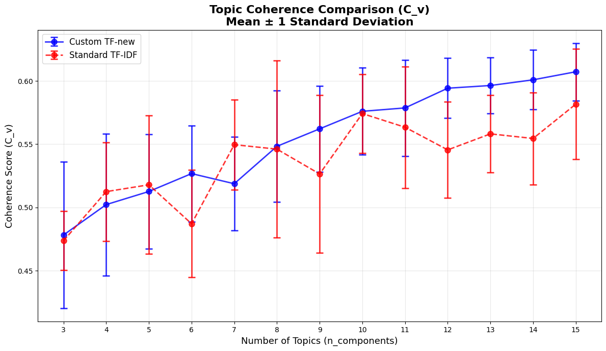
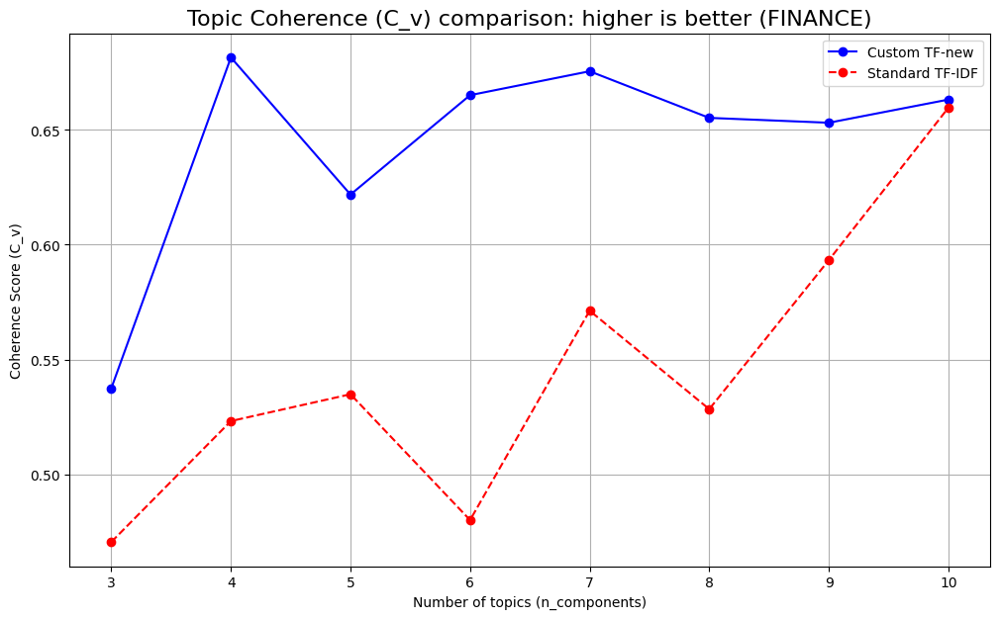

# TF-SYN-NER-Rel: A Structurally-Aware Method for Thematic Modeling

This repository contains the Python implementation of **TF-SYN-NER-Rel**, a novel text vectorization method designed to enhance the quality and interpretability of topic models. The method addresses the "syntactic blindness" of classical TF-IDF by enriching document vectors with explicit linguistic information, including syntax, semantics, and named entities. This approach results in more coherent, granular, and analytically valuable topics.

## 1. Problem Statement: Syntactic Blindness in Bag-of-Words Models

Traditional topic modeling pipelines, such as Latent Dirichlet Allocation (LDA), rely on the Bag-of-Words (BoW) model, typically weighted by TF-IDF. This approach is "syntactically blind"—it ignores word order and grammatical roles, failing to distinguish between the **agent** (subject) and the **patient** (object) of an action.

For example, a classical TF-IDF vectorizer would treat the following sentences as nearly identical:
- `"Company A acquires Company B."`
- `"Company B acquires Company A."`

This limitation leads to the generation of semantically ambiguous or "mixed" topics (e.g., a single "M&A Deals" topic), which are of little use for fine-grained analysis that requires understanding *who did what to whom*.

## 2. The Proposed Method: TF-SYN-NER-Rel

Our method replaces the standard Term Frequency (TF) component with a weighted frequency, **`TF_new`**, which captures the structural and semantic importance of each word token. The final weight `W_new(t, d)` for a term `t` in a document `d` is calculated as:

**W_new(t, d) = TF_new(t, d) × IDF(t, D)**

The core innovation lies in the `TF_new` component, which is defined as the sum of weighted occurrences of a term `t`:

**TF_new(t, d) = Σ [λ_pos(t_i) ⋅ λ_syn(t_i) ⋅ λ_fact(t_i) ⋅ λ_NER(t_i)]**
*(summation over all occurrences `t_i` where `lemma(t_i) = t`)*

Each occurrence `t_i` is weighted by the product of four coefficients:

*   **`λ_pos` (Positional Weight):** Assigns higher weight to tokens based on their position (title, first sentence), leveraging the "inverted pyramid" principle of journalism.
*   **`λ_syn` (Syntactic Weight):** Amplifies the weight of key sentence components, giving the highest scores to the root (main verb), subject (`nsubj`), and direct object (`obj`). This is key to resolving agent-patient ambiguity.
*   **`λ_fact` (Factual Weight):** Provides a weight boost to tokens that are part of an extracted "subject-verb-object" fact, focusing the model on the core semantic statements of the document.
*   **`λ_NER` (Named Entity Weight):** Increases the weight of tokens identified as part of a named entity (e.g., ORG, PER, LOC), highlighting key actors and locations.

## 3. Installation and Setup

### 3.1. Python Dependencies


It is recommended to use a virtual environment. Install all required packages using `pip`:
```bash
# Core libraries
pip install pandas openpyxl tqdm matplotlib scikit-learn gensim pymorphy2

# Specific versions of NLP components are required for compatibility
pip install "natasha<1" "yargy<0.13"
```

### 3.2. Pre-trained Models

The pipeline relies on pre-trained models for the Russian language. These must be downloaded manually and placed in the user's home directory.

**a) Create the required directory structure:**
   In your home directory (`C:\Users\YourName` or `~/`), create the following folders:
```Code
.natasha/
├── navec/
└── slovnet/
```

**b) Download and place the 4 model files:**

| Model                 | Filename                                | Sourse                                                                              | Link                     | Destination Folder |
|-----------------------|-----------------------------------------|-------------------------------------------------------------------------------------|----------------------|--------------------|
| **Navec Embeddings**  | `navec_news_v1_1B_250K_300d_100q.tar`    | `https://github.com/natasha/navec`                                                  | `https://storage.yandexcloud.net/natasha-navec/packs/navec_news_v1_1B_250K_300d_100q.tar`                     | `.natasha/navec/`  |
| **Slovnet Morphology**| `slovnet_morph_news_v1.tar`             | `https://github.com/natasha/slovnet`                                                | `https://storage.yandexcloud.net/natasha-slovnet/packs/slovnet_morph_news_v1.tar`                    | `.natasha/slovnet/`|
| **Slovnet Syntax**    | `slovnet_syntax_news_v1.tar`            | `https://github.com/natasha/slovnet`                                                | `https://storage.yandexcloud.net/natasha-slovnet/packs/slovnet_syntax_news_v1.tar`                     | `.natasha/slovnet/`|
| **Slovnet NER**       | `slovnet_ner_news_v1.tar`               | `https://github.com/natasha/slovnet`                                                | `https://storage.yandexcloud.net/natasha-slovnet/packs/slovnet_ner_news_v1.tar`                     | `.natasha/slovnet/`|


## 4. Usage

The main script is driven by a central `CONFIG` dictionary.

### 4.1. Data
The dataset used to run the pipeline is publicly available at: https://disk.yandex.com/d/OYhwgBWCRFx_Nw

### 4.2. Configuration

Before running, modify the `CONFIG` object in the script to specify:
*   `data["filepath"]`: Path to the input CSV file.
*   `data["rename_columns"]`: Mapping of your CSV columns to `{"Your Text Column": "full_text", "Your Title Column": "header_text"}`.
*   `filter["keywords"]`: A set of keywords to filter the dataset for a specific domain (e.g., finance, politics).

### 4.3. Running the Pipeline

Place your data file in the project directory and execute the script:
`TF-SYN-NER-Rel.py`
The pipeline will perform all steps: loading and filtering data, NLP preprocessing, building matrices for both standard and custom models, calculating topic coherence, plotting a comparison graph, and printing the final topics.
### 5. Key Findings & Results
Experiments conducted on large Russian news corpora demonstrate the superiority of the TF-SYN-NER-Rel method.
Quantitative Comparison (Topic Coherence C_v) `coherence_deviation_pipeline.py`
The proposed method (blue line) consistently achieves higher topic coherence scores than the standard TF-IDF baseline (red line), indicating more meaningful and semantically cohesive topics. 



The actual output of the executed code `TF-SYN-NER-Rel.py`, using the applied settings and filtering, is shown in the figure below:



### 6. License
This project is licensed under the MIT License.

